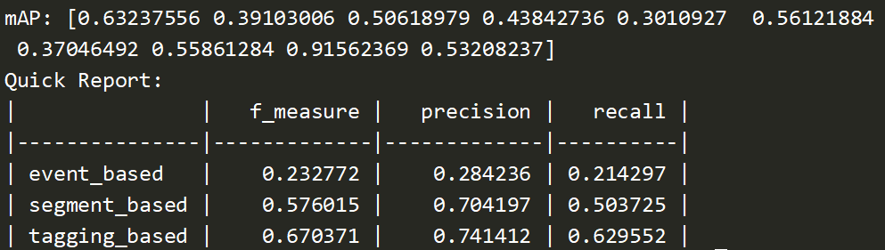

### Commands for running

```bash
# extract feature 
cd data
sbatch prepare_data.sh /dssg/home/acct-stu/stu464/data/domestic_sound_events
cd ..

# train and test
# run.sh has two args: cuda_id and configuration_file
bash run.sh 0 configs/best.yaml
```

### Task summary

- **Basic requirements are FINISHED:** Read the code, learn the SED model and the challenges in WSSED, realize the baseline CRNN model.
- **High-level requirements are FINISHED:** Adjust the number of the blocks (depth of model), the dimension of feature vector, and other parameters in data augmentation and post processing. Investigate the data augmentation methods and realize them in the code.
- **Report requirements are FINISHED:** See Report.pdf.

### Best result

With 4-blocks, Time Masking Augmentation and Triple Threshold:

